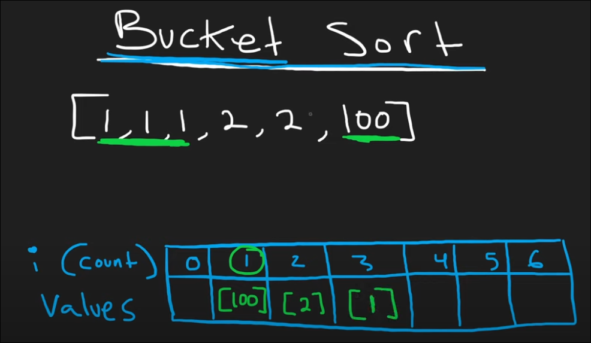

### 1. Contains Duplicate 

- **1st thought** --> convert `nums` to a set, say `map` and compare lengths of them, if equal then return False else return True (distinct found)

###### Approach 1 - Bruteforce 

Time complexity = O(n^2)   --> cuz each element hold and check with entire array 
Space complexity = O(1)

###### Approach 2 - Sorting 

Time complexity = O(nlogn)   --> cuz sorting is involved
Space complexity = O(1)   

###### Optimal Solution - Hash Set {same as 1st thought}

```python
class Solution:
	def containsDuplicate(self, nums: List[int]) -> bool:
			return len(set(nums)) != len(nums)
```

Time complexity = O(n)
Space complexity = O(n)

_Note: It's a tradeoff between time and space to get the optimal solution_

---

### 2. Valid Anagram 

- **1st Thought** --> sort `s` and `t` using the **_sorted(s)_** function for strings and then `zip` them and create a `key value pair` kinda thing and then compare if each pair is equal, if yes then return True else return False

```python
class Solution:
	def isAnagram(self, s: str, t: str) -> bool:
		s=sorted(s)
		t=sorted(t)
		if len(s) != len(t):
			return False
		
		for a,b in zip(s,t):
			if a!=b:
				return False
		return True
```

Above solution passes all test cases but with just _20%_ beats so not very efficient

Found out after seeing solution that just doing sorted is enough so basically:
```python
class Solution:
	def isAnagram(self, s: str, t: str) -> bool:
		return sorted(s) == sorted(t)
```

###### Optimal Solution - HashMap Count

```python
class Solution:
    def isAnagram(self, s: str, t: str) -> bool:
	    if len(s) != len(t):
		    return False

		map = {}
		for char in s:
			map[char] = map.get(char,0) + 1
		for char in t:
			if char not in map or map[char]==0:
				return False
			map[char] -= 1
		return True
```

> 1. compare lengths of s and t, if unequal then direct False
> 2. store hashmap for s with (key,value) = (char,count)
> 3. iterate through characters of t and check if present in hashmap of s, if not present then False and then decrement count of char by 1 after each iteration of a character until it hits 0
> 4. else just return True 

Time complexity = O(n)
Space complexity = 0(1) / O(n) in worst case 

---

### 3. Two Sum 

- **1st Thought** - keep hashmap of seen elements and check if `complement` of target will be there in the hashmap and if yes then return the index of complement and num else add the num to hashmap

###### Optimal Solution - HashMap Lookup

```python
class Solution:
    def twoSum(self, nums: List[int], target: int) -> List[int]:
        dict = {}

        for i,num in enumerate(nums):
            diff = target - num
            if diff in dict:
                return [dict[diff], i]
            dict[num] = i
```

> 1. Create a hashmap (`dict`) to store numbers and their indices  
> 2. For each `num`, compute `target - num` (the complement)  
> 3. If the complement is already in hashmap, return its index and current index  
> 4. Otherwise, add current number to hashmap  

**Time Complexity:** `O(n)`  
**Space Complexity:** `O(n)`  

---

### 4. Group Anagrams

**1st Thought** - anagrams when `sorted()` are always equal, so group all the same words after sorting and then keep it in a dictionary maybe 

Well the above solution does work but its pathetic in terms of time complexity, so how can we optimize it?
Boom, here comes HashMap, so we maintain a hashmap `count` which maintains count of all characters in the string (it'll be of length `26`) 

```python
class Solution:
    def groupAnagrams(self, strs: List[str]) -> List[List[str]]:
	    res = defaultdict(list)

		for s in strs:
			count = [0] * 26
			for c in s:
				count[ord(c) - ord("a")]+=1
			res[tuple(count)].append(s)
		return list(res.values())
```
>- Instead of sorting each string (which takes O(k log k)), we count how many times each letter appears (which takes O(k)).   
>- We use a **26-length list** (for 'a' to 'z') to store counts of letters in each word.
>- We convert that list into a tuple (since lists aren’t hashable) and use it as the key in a hashmap.
>- All words with the same frequency of letters (i.e., anagrams) will map to the same key.
>- At the end, we just return the grouped lists from the hashmap.

Time complexity =  **O(n * k)** —> `n` words, each with max length `k`
Space complexity = **O(n * k)** —> storing the output and hashmap keys.

---

### 5. Top K Frequent Elements

**1st Thought** - keep a `seen` hashmap and iterate through `nums` and add `n` if its not in seen and if found again then keep a count and increase its value then check if count >= k, if yes then append to result and then finally return result   <br>
_Note -  **this is just 1st thought process, it may not be right**_

On 2nd thought, we should probably use hashmap + minheap K times


There's also a more efficient way `O(n)` time called _**Bucket Sort**_ as described below, now just return the first K elements from the rightmost index (i.e., 6)
max size of the new array will be _**len(input array)**_



###### Approach 1 - Bucket Sort (most optimal solution in linear time O(n))
```python
class Solution:
    def topKFrequent(self, nums: List[int], k: int) -> List[int]:
        count = {}
        freq = [[] for i in range(len(nums)+1)]

        for n in nums: # storing count of numbers in hashmap as key:value pair
            count[n] = count.get(n,0) + 1
        
        for n, c in count.items():
            freq[c].append(n)

        res = []
        for i in range(len(freq)-1,0,-1):
            for ele in freq[i]:
                res.append(ele)
                if len(res) == k:
                    return res
```

> - Use a `count` hashmap to track frequency of each number.  
> - Create a `freq` list (bucket) where index = frequency, and values are lists of numbers with that frequency.  
> - Traverse the `freq` list from end to start and collect elements until we have `k` elements. 

*O(n) for both complexities* 
###### Approach 2 - Min Heap

```python
class Solution:
    def topKFrequent(self, nums: List[int], k: int) -> List[int]:
        heap = []
        count = {}

        for n in nums:
            count[n] = count.get(n,0) + 1
        # since default is minheap, convert to maxheap by taking -ve 
        heap = [(-freq,val) for val,freq in count.items()]
        heapq.heapify(heap)
        res = []
        while k:
            res.append(heapq.heappop(heap)[1])
            k-=1
        return res
```

> - Count frequency of each number using a hashmap (`count`).  
> - Convert `(val, freq)` into `(-freq, val)` to simulate a max heap (since Python's `heapq` is min-heap by default).  
> - Push all `(-freq, val)` into a list and `heapify` it.  
> - Pop `k` times from the heap to get the top `k` most frequent elements.  

- ***Time complexity: O(nlog⁡k)***
- ***Space complexity: O(n+k)*** 
---
### 6. Encode and Decode [Neetcode Premium]

- We have to code the `encode` and `decode` functions but the challenge is that the string can have any characters and not just lowercase alphabets, so.... WTF do we use as a delimiter??

> 1. we can prepend `len(word)` + `#` to each word and then join them all to encode 
> 2. we can decode by parsing `<number>#` and then parse the number of letters as a string and keep it in list

Time complexity = O(n)


```python
class Solution:
    def encode(self, strs: List[str]) -> str:
        res = ""
        for s in strs:
            res += str(len(s)) + "#" + s
        return res
        
    def decode(self, s: str) -> List[str]:
        res , i = [] , 0
        while i < len(s):
            j = i
            while s[j] != '#':
                j+=1
            length = int(s[i:j])
            res.append(s[j + 1:j +1 + length])
            i = j + 1 + length
        return res
```

TLDR :

> - `encode`: For each string, store it as `length#string`. So `["hello", "world"]` becomes `5#hello5#world`
>- `decode`: Read characters until you hit `#` → that's the length. Then read the next `length` characters and repeat.

---
### 7. Product of Array Except Self

***1st Thought*** - take factorial of the array and then divide by `nums[i]` but edge cases think of new logic 

*Note - later in question i saw, it said `without using division operation`* 

###### Optimal Solution:


*Note - by default for start and end indexes, prefix and postfix = 1 respectively*

- ***Prefix Array Logic*** - multiply and store all the numbers in the array before `i` including `i`
- ***Postfix Array Logic*** - multiply and store all the numbers in the array after `i` including `i`

```python
class Solution:
    def productExceptSelf(self, nums: List[int]) -> List[int]:
        res = [1] * len(nums)

        prefix = 1
        for i in range(len(nums)):
            res[i] = prefix
            prefix *= nums[i]

        postfix = 1
        for i in range(len(nums)-1 , -1, -1):
            res[i] *= postfix
            postfix *= nums[i]
        return res  
```

TLDR :

Avoid division by computing the result using two passes:

- **Prefix pass (Left to Right)**:  
 At index `i`, store the product of all elements to the left of `i`.    
`res[i] = prefix` → then update `prefix *= nums[i]`

- **Postfix pass (Right to Left)**:  
 Multiply existing value at `res[i]` by the product of all elements to the right of `i`.  
`res[i] *= postfix` → then update `postfix *= nums[i]`

- Time Complexity = O(n)
- Soace Complexity = O(1) excluding the output array space 

---
### 8. Valid Sudoku


- row + column validation is pretty easy as we just maintain `hashmap` and check for duplicates which has a ***O(1)*** time complexity for searching as well as adding elements 
<br>
> Total --> O(81) because search+add in hashmap is just size of the entire grid 9^2


```python
class Solution:
    def isValidSudoku(self, board: List[List[str]]) -> bool:
        cols = collections.defaultdict(set)
        rows = collections.defaultdict(set)
        squares = collections.defaultdict(set)  # key = (r/3 , c/3)

        for r in range(9):
            for c in range(9):
                if board[r][c] == ".":
                    continue
                if (board[r][c] in rows[r] or 
                    board[r][c] in cols[c] or
                    board[r][c] in squares[(r//3,c//3)]):
                    return False
                cols[c].add(board[r][c])
                rows[r].add(board[r][c])
                squares[(r//3,c//3)].add(board[r][c])
        return True

```

TLDR :
>⚙️ **Core Idea**:  
>Use **3 hash sets** to track seen values in:
>- `rows`: index `r`
>- `cols`: index `c`
>- `squares`: index `(r//3, c//3)` for the 3x3 sub-boxes
>For each filled cell, check if the value has already been seen in the corresponding row, column, or box. If yes → board is invalid.

---
### 9. Longest Consecutive Sequence
<br>


- doesnt matter in which order the numbers in the array are, if its consecutive then count as a sequence and find maximum 
<br>


```python
class Solution:
    def longestConsecutive(self, nums: List[int]) -> int:
        arr = set(nums)
        longest = 0

        for n in nums:
            if (n-1) not in arr:
                length = 0 
                while (n + length) in arr:
                    length+=1
                longest = max(longest,length)
        return longest
```

TLDR :

>⚙️ **Core Idea**:
>- Convert the list to a `set` for O(1) lookups.
>- Only **start counting** a sequence if the **previous number (`n-1`) doesn’t exist** → ensures we only count from sequence start.
>- Expand the sequence using a `while` loop (`n+length` in set).
>- Track and update the `max` sequence length

---
