### 1. Search a 2D matrix

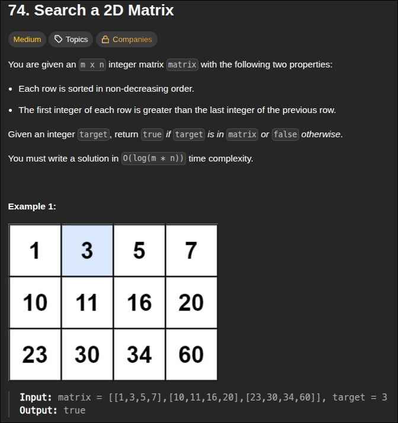
 - ***DOUBLE BINARY SEARCH*** one to find which row to do BS in and another to actually do it
 - compare the `matrix[row][-1]` for last element in row and `matrix[row][0]` for 1st element in row

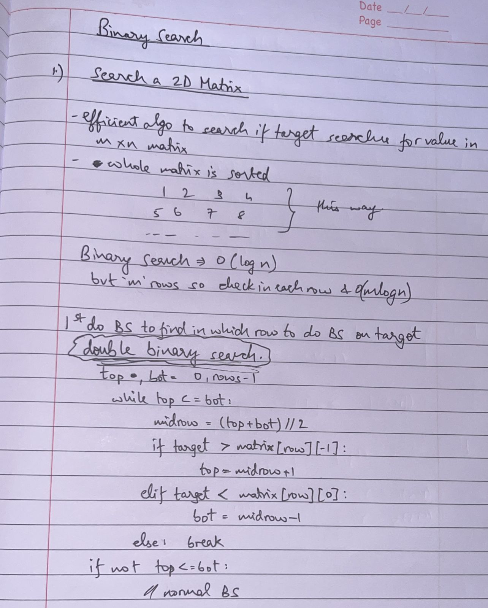

```python
class Solution:
    def searchMatrix(self, matrix: List[List[int]], target: int) -> bool:
        rows = len(matrix)
        cols = len(matrix[0])

        top, bot = 0,rows-1
        while top<=bot:
            row = (top+bot)//2
            if target > matrix[row][-1]:
                top = row+1
            elif target < matrix[row][0]:
                bot = row-1
            else:
                break
        
        if not top<=bot: # if number not in any of these rows 
            return False
        
        row = (top+bot)//2
        l,r = 0, cols-1
        while l<=r:
            mid = (l+r)//2
            if target == matrix[row][mid]:
                return True
            elif target > matrix[row][mid]:
                l=mid+1
            else:
                r=mid-1
        return False
```

---

### 2. Koko Eating Bananas

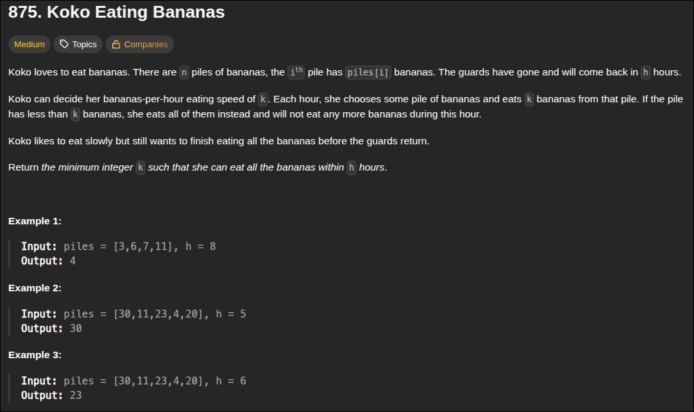
- condition is `len(piles) <= h` cuz 1 pile 1 hour max KoKo can eat even if pile has less bananas

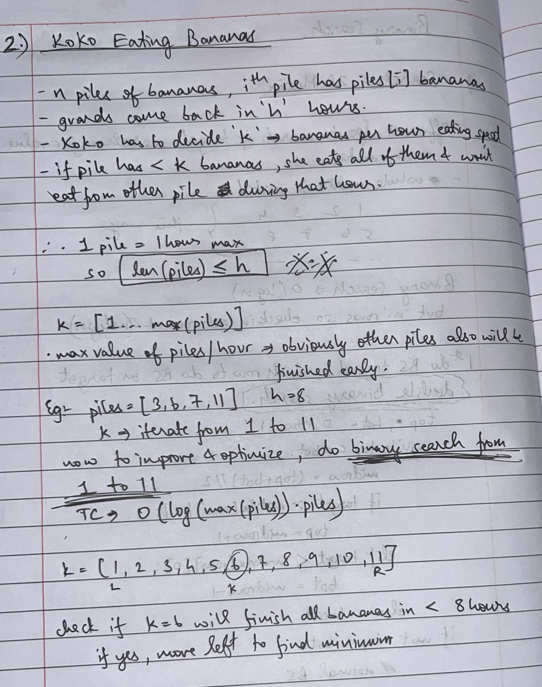

```python
class Solution:
    def minEatingSpeed(self, piles: List[int], h: int) -> int:
        l,r  = 1, max(piles)
        res = r
        while l<=r:
            k = (l+r)//2
            hours = 0
            for p in piles:
                hours += math.ceil(p/k)
            
            if hours<=h:
                res = min(res,k)
                r=k-1
            else:
                l=k+1
        return res
```

---

### 3. Find Minimum in Rotated Sorted Array

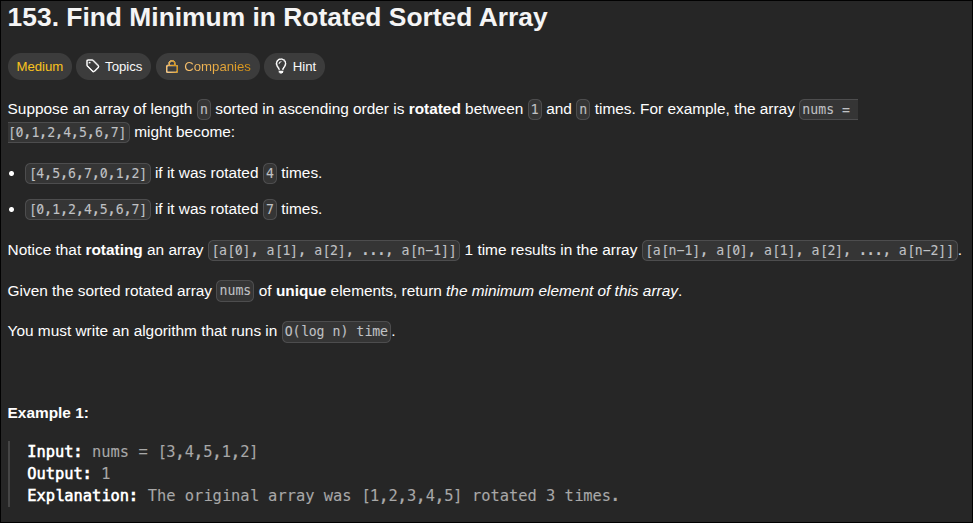

- somewhere in the middle comes a `pivot element` after which the trend reverses
- according to the condition, obviously the left part will be cut (acc to Binary search logic) and we get L=M+1 and search right 
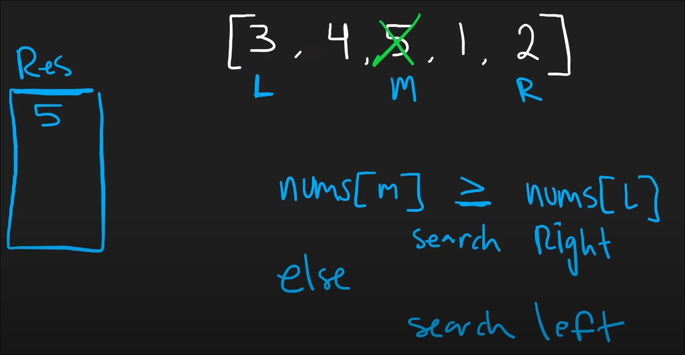

```python
class Solution:
    def findMin(self, nums: List[int]) -> int:
        res = nums[0]

        l,r = 0, len(nums)-1

        while l<=r:
            if nums[l] < nums[r]: # then not rotated and in proper sorted format (no more pivots)
                res = min(res, nums[l])
                break
            mid = l + ((r-l)//2)
            res = min(res, nums[mid])
            # left sorted part
            if nums[mid] >= nums[l]: # search towards right
                l = mid+1
            else: # search towards left
                r = mid-1
        return res
```

---

### 4. Search in Rotated Sorted Array

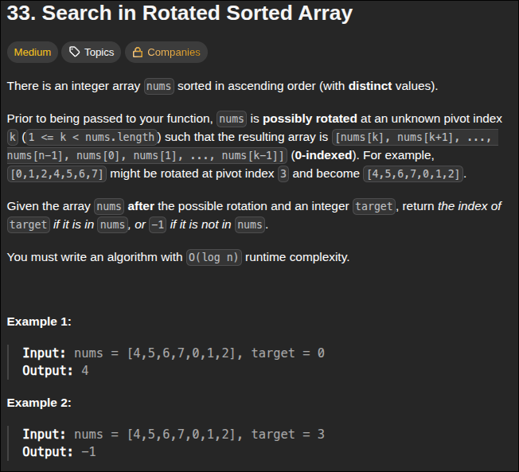
- use the fact that the array is a rotated sorted array and adjust it for binary search 

- if ***`L<=M`*** then M belongs to left sorted portion so ***search towards right*** (2 conditions separated by OR) else M belongs to right sorted portion so ***search towards left*** 

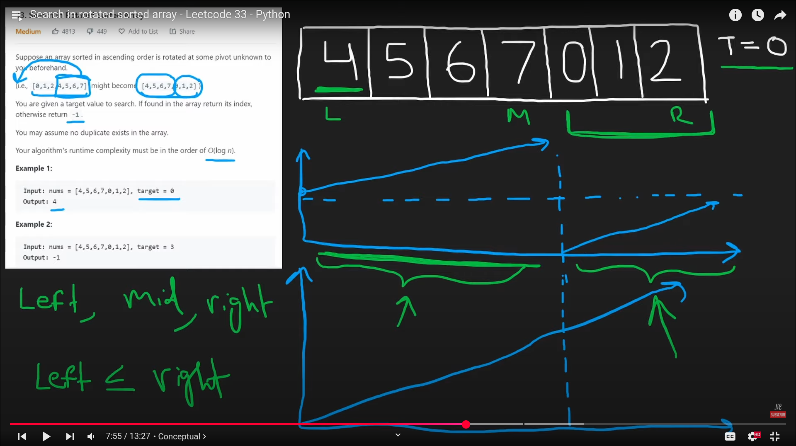

```python
class Solution:
    def search(self, nums: List[int], target: int) -> int:
        l,r = 0, len(nums)-1
        while l<=r:
            m = l + ((r-l)//2)
            if target == nums[m]:
                return m
            # left sorted portion
            if nums[l] <= nums[m]:
                if target > nums[m] or target < nums[l]: # search rightside
                    l = m+1
                else:
                    r = m-1
            # right sorted portion
            else:
                if target < nums[m] or target > nums[r]: #search leftside
                    r = m-1
                else:
                    l = m+1
        return -1
```

---

### 5. Time Based Key Value Store

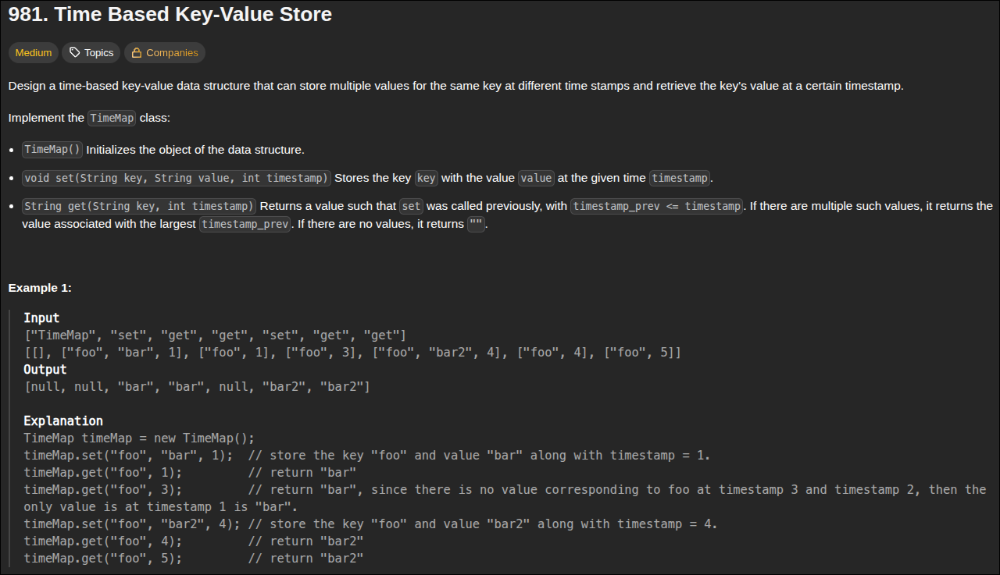

- this is a very logical and less code based solution, see the constraints it'll be given ***time is strictly increasing*** so direct O(log n) binary search
- it's quite obvious because time can only go in one direction, that shi dont wait for no one
- theres 2 functions, `get and set` --> GET will get closest timestamp value and SET will append to hashmap 

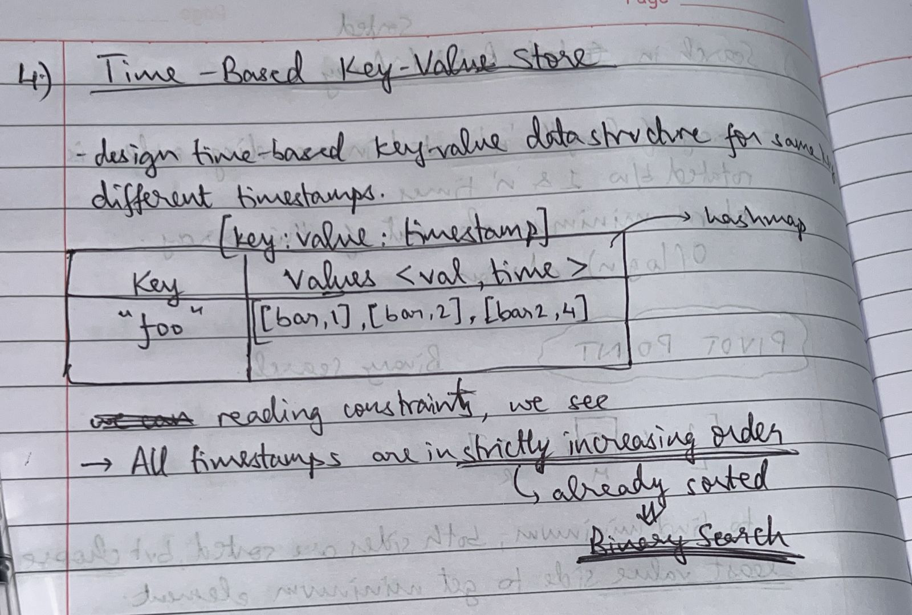

```python
class TimeMap:
    def __init__(self):
        self.store = {} # key=string, value = [list of [value,timestamp]]

    def set(self, key: str, value: str, timestamp: int) -> None:
        if key not in self.store:
            self.store[key] = []
        self.store[key].append([value,timestamp])

    def get(self, key: str, timestamp: int) -> str:
        res = ""
        values = self.store.get(key, []) # return key's values [value,timestamp] if values for it exist else return []

        # binary search time
        l, r = 0, len(values)-1
        while l<=r:
            mid = l + (r-l) // 2
            if values[mid][1] <= timestamp:
                res = values[mid][0]
                l = mid+1
            else:
                r = mid-1
        return res
```

---

### 6. Median of Two Sorted Arrays

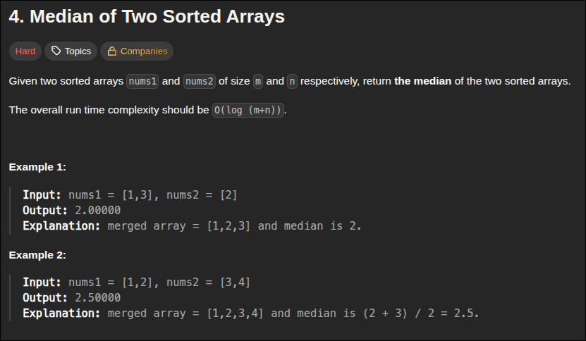

- one of the hardest LC problem, due to complexity of O(log(m+n)) 

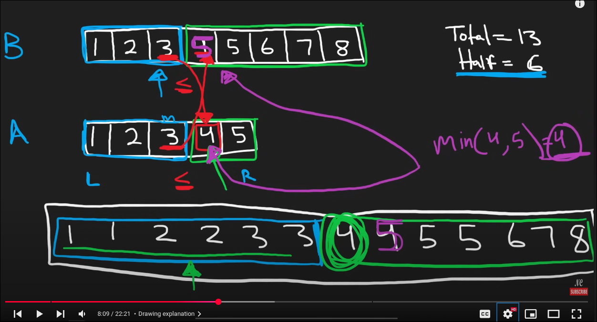

- here's the complete methodology explained in detail - once you understand the flow and method, its easy to code it - just take care of the ***edge conditions*** like out of bound exceptions of LEFT and RIGHT using `-inf` and `+inf`

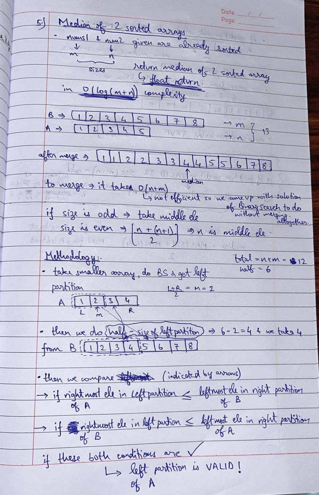

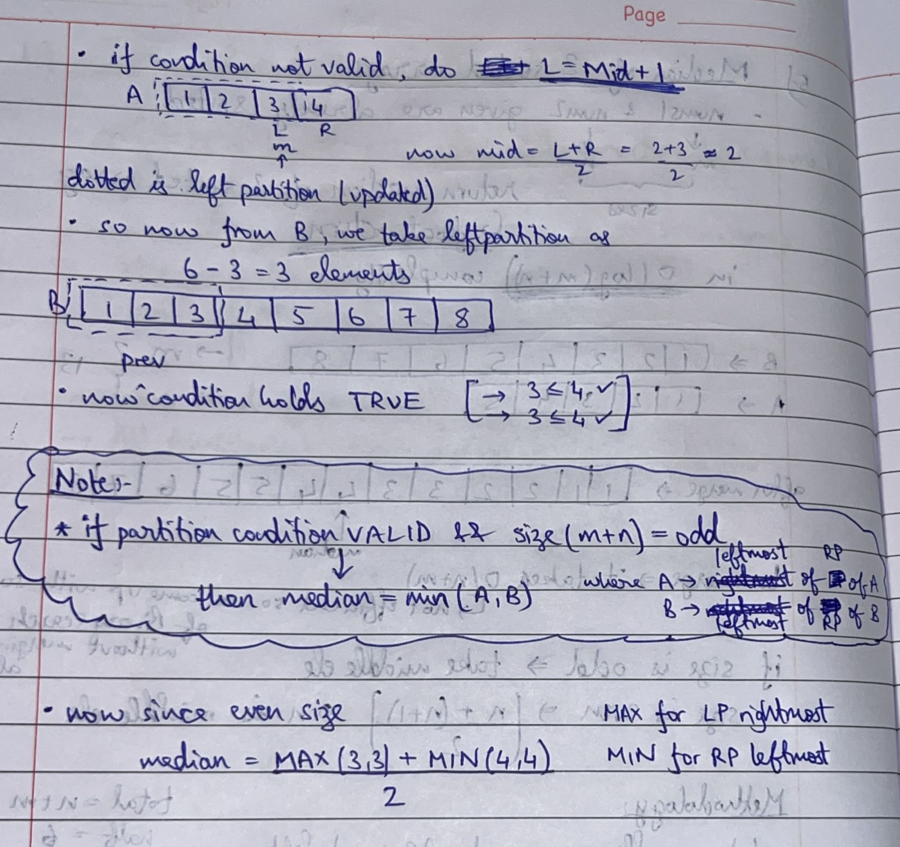

```python
class Solution:
    def findMedianSortedArrays(self, nums1: List[int], nums2: List[int]) -> float:
        A, B = nums1, nums2
        total = len(nums1) + len(nums2)
        half = total // 2

        # take A is the smaller basically by default
        if len(B) < len(A):
            A,B = B,A
        
        # Binary Search on A
        l, r = 0, len(A) - 1
        while True:
            i = (l + r) // 2
            j = half - i - 2 # normalize by adding -2 since its index

            # set the values of LP rightmost & RP leftmost for A and B, taking care of out-of-bound exceptions
            Aleft = A[i] if i >= 0 else float('-inf')
            Aright = A[i+1] if (i+1) < len(A) else float('inf')
            Bleft = B[j] if j >= 0 else float('-inf')
            Bright = B[j+1] if (j+1) < len(B) else float('inf')

            # partition is correct
            if Aleft <= Bright and Bleft <= Aright:
                # for odd size
                if total % 2 != 0:
                    return min(Aright, Bright)
                # for even size 
                return (max(Aleft, Bleft) + min(Aright,Bright)) / 2
            elif Aleft > Bright:
                r = i - 1
            else:
                l = i + 1
```

---
