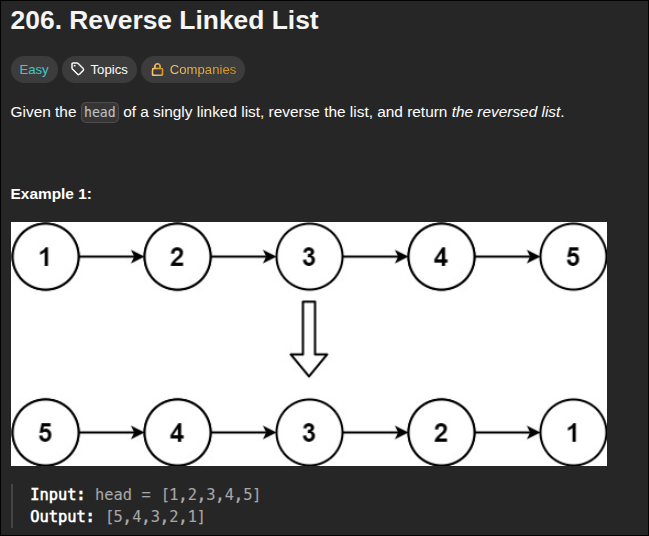
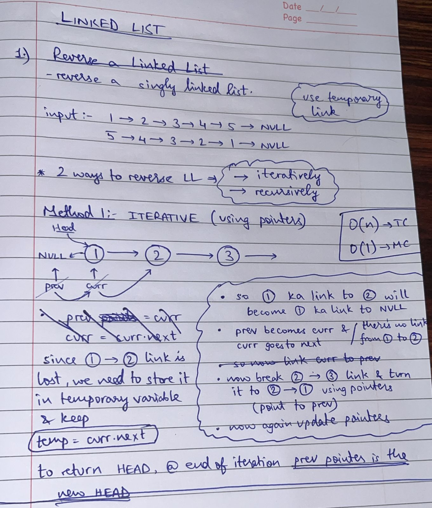
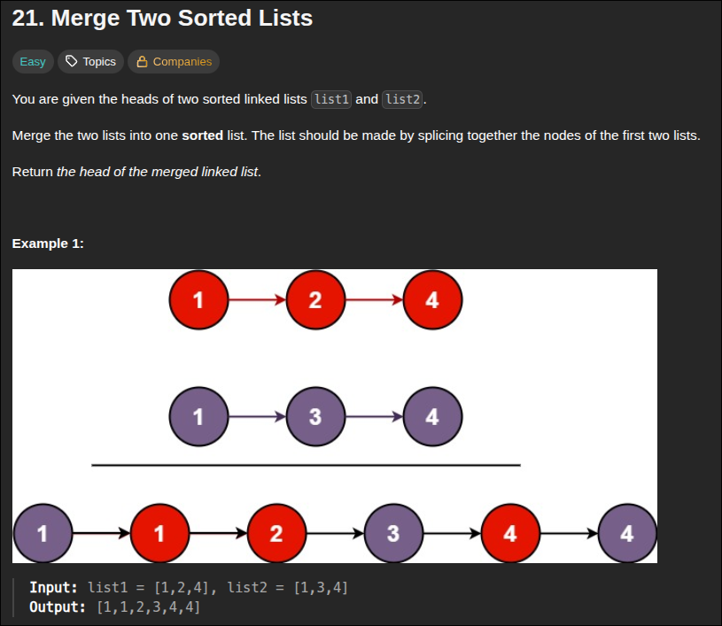
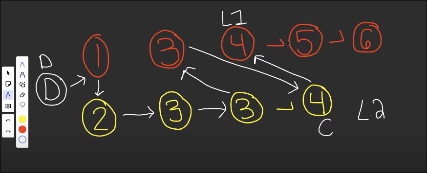
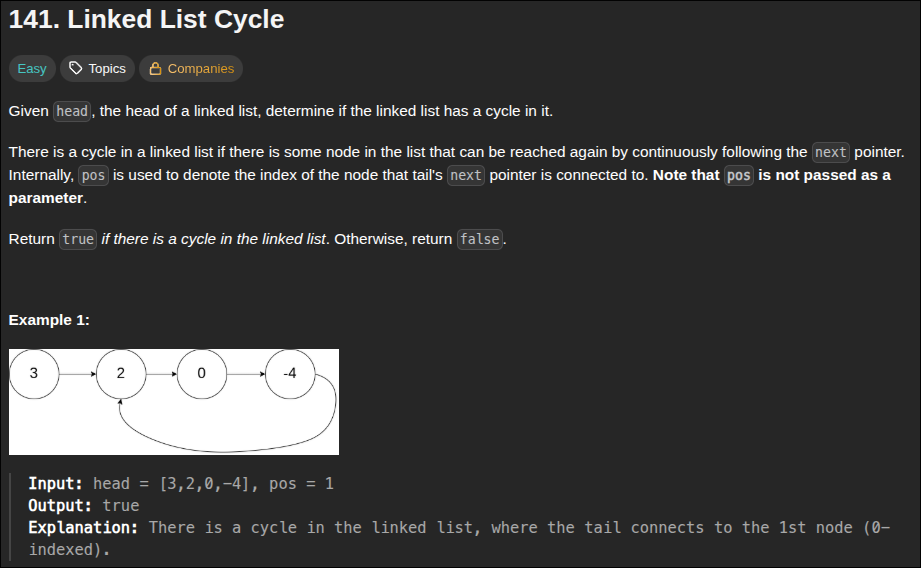
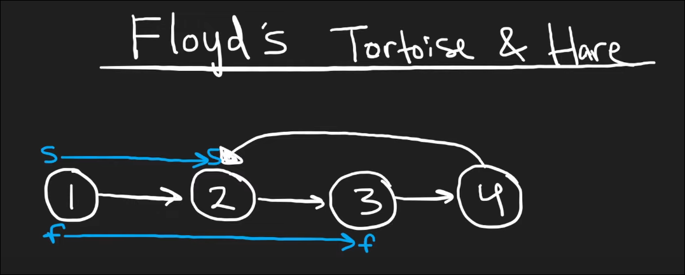
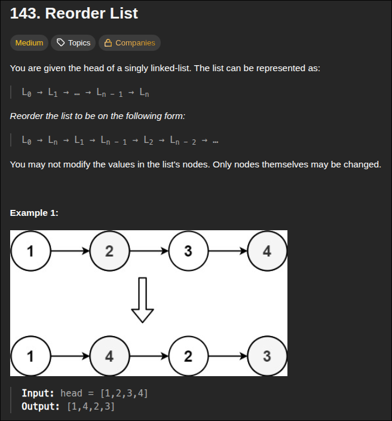
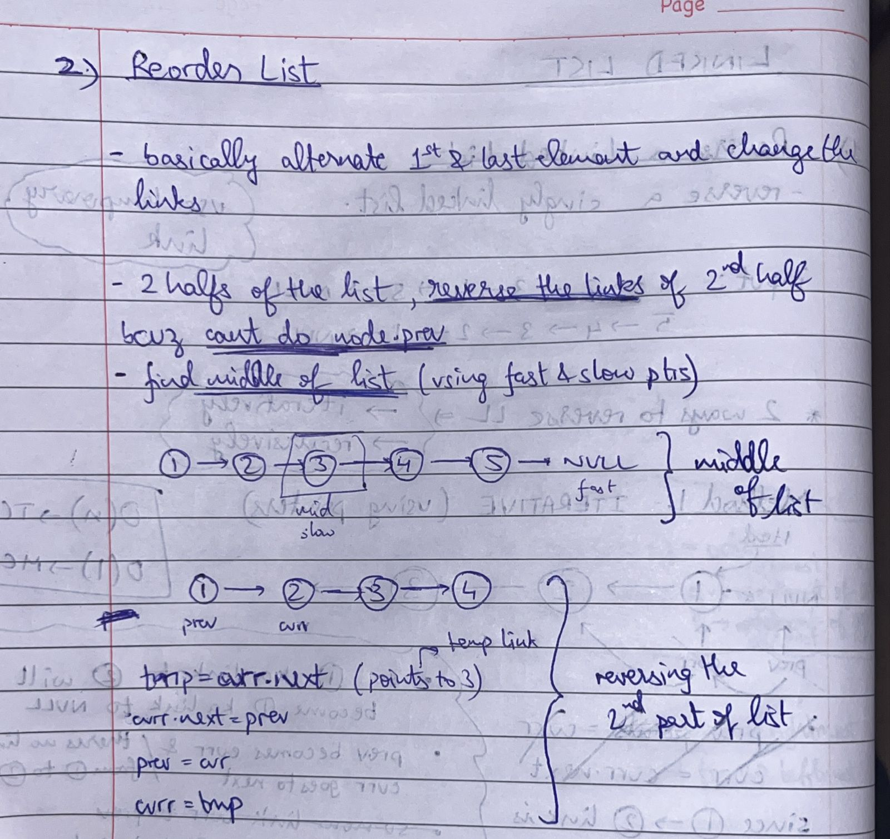

### 1. Reverse a Linked List



- there's 2 approaches  :
> 1. Iterative  = **O(n) TC and O(1) SC**
> 2. Recursive = **O(n) TC and O(n) SC**

- main idea is to store next link in a temp variable and then update pointers


```python
# Definition for singly-linked list.
# class ListNode:
#     def __init__(self, val=0, next=None):
#         self.val = val
#         self.next = next

class Solution:
    def reverseList(self, head: Optional[ListNode]) -> Optional[ListNode]:
        prev = None
        curr = head
        while curr:
            temp = curr.next
            curr.next = prev
            prev = curr
            curr = temp

        return prev
```

---

### 2. Merge Two Sorted Lists



- to avoid edge cases in Linked List problems always create a ***dummy node (empty node)*** and start adding to that
- keep pointers at start of `List1` and `List2` , now compare these both and add the smaller one to output LL and after addition move pointer and compare and repeat

> #### *Just change the links within the LL and no need for extra space* 




```python
# Definition for singly-linked list.
# class ListNode:
#     def __init__(self, val=0, next=None):
#         self.val = val
#         self.next = next
class Solution:
    def mergeTwoLists(self, list1: Optional[ListNode], list2: Optional[ListNode]) -> Optional[ListNode]:
        d = ListNode()
        cur = d

        while list1 and list2:
            if list1.val < list2.val:
                cur.next = list1
                cur = list1
                list1 = list1.next
            else:
                cur.next = list2
                cur = list2
                list2 = list2.next
        
        cur.next = list1 if list1 else list2
        
        return d.next
```

---
### 3. Linked List Cycle 



- What i thought at first was, keep a ***hashmap*** and add node value to it everytime and if theres any repetition, then there is a cycle

> But in case of duplicates in the LL how to handle, thats why i dropped the hashmap but turns out that we dont add the value of node, but the entire node itself to the hashmap, that way even duplicates wont matter
> ***O(n) Time complexity***

- `Floyd's algorithm`  - ***Fast and Slow pointers concept*** to detect if there exists a cycle 
> ### This is a O(1) space complexity solution 



```python
# Definition for singly-linked list.
# class ListNode:
#     def __init__(self, x):
#         self.val = x
#         self.next = None

class Solution:
    def hasCycle(self, head: Optional[ListNode]) -> bool:
        slow,fast = head,head

        while fast and fast.next:
            slow = slow.next
            fast = fast.next.next
            if slow == fast:
                return True
        return False
```

---
### 4. Reorder List



- we should do it in O(n) time compelxity and O(1) space complexity, meaning we should do it in-place
- problem is we cant do `head.prev` there doesnt exist something like this in LL , so for ***2nd half of list***, we'll ***reverse the linked list*** and then go till `middle of the list` and stop  

> NOTE : to detect middle of LL, ***take slow (at 0th position) and fast pointer (at 1st position)*** and move +1 and +2 accordingly and when ***fast.next is NULL*** then we have slow at middle position 



```python
class Solution:
    def reorderList(self, head: Optional[ListNode]) -> None:
        slow,fast = head,head.next
        # to find middle of list (slow's destination)
        while fast and fast.next:
            slow = slow.next
            fast = fast.next.next

        second = slow.next # temporary link storage
        prev = slow.next = None # because at end, middle points to NULL

        # reverse second part of list
        while second:
            tmp = second.next
            second.next = prev
            prev = second
            second = tmp
        
        # merge the 2 halfs
        first, second = head, prev # after reverse, prev will be the last node (new head after reverse)
        while second:
            tmp1, tmp2 = first.next, second.next
            first.next = second
            second.next = tmp1
            first,second = tmp1,tmp2
```

---
### 5. 
