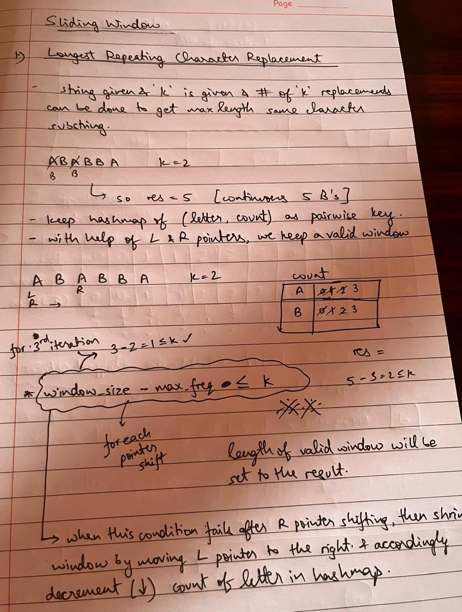
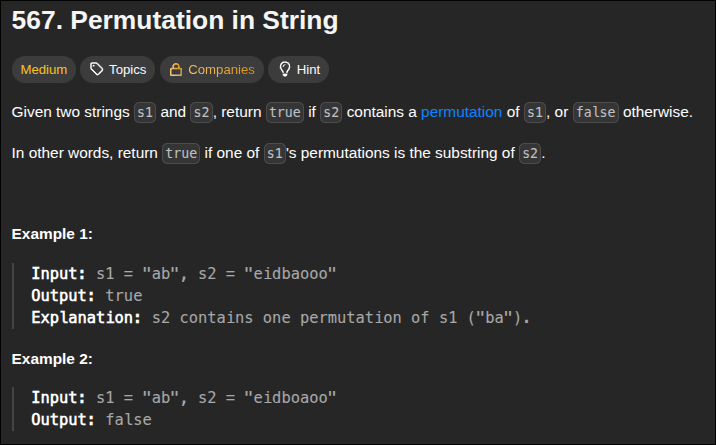
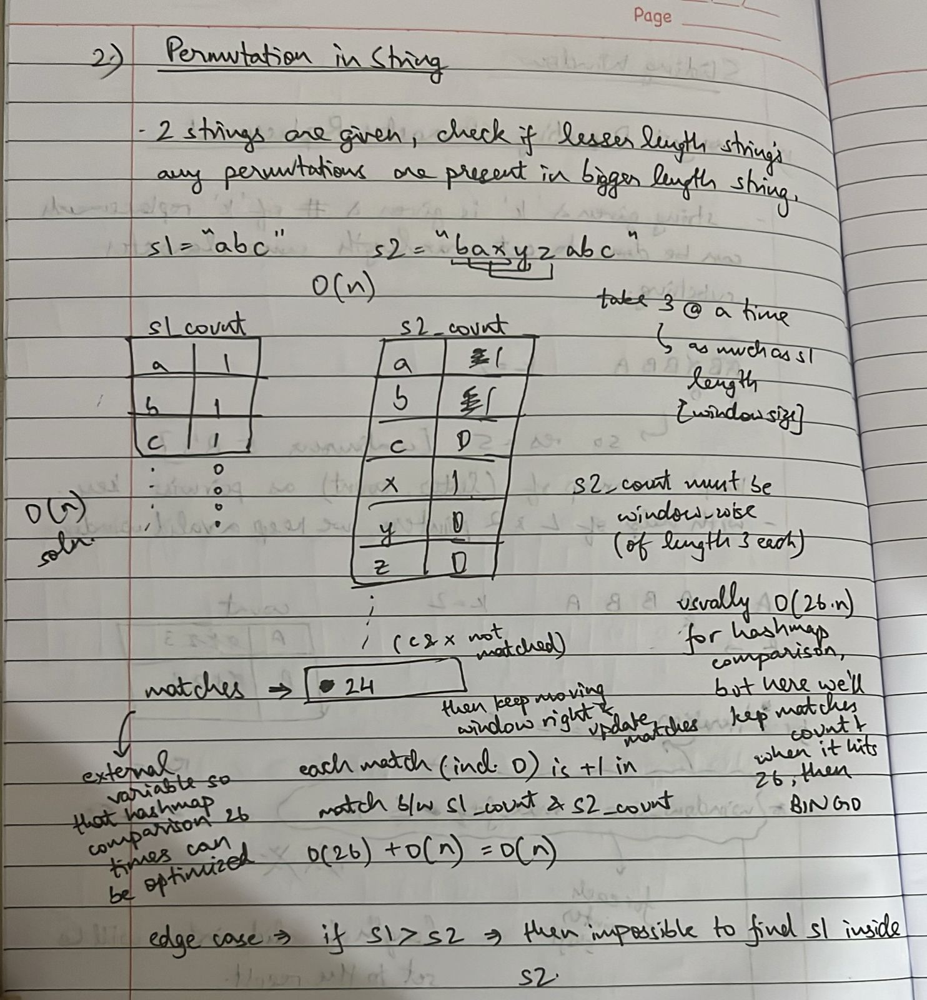
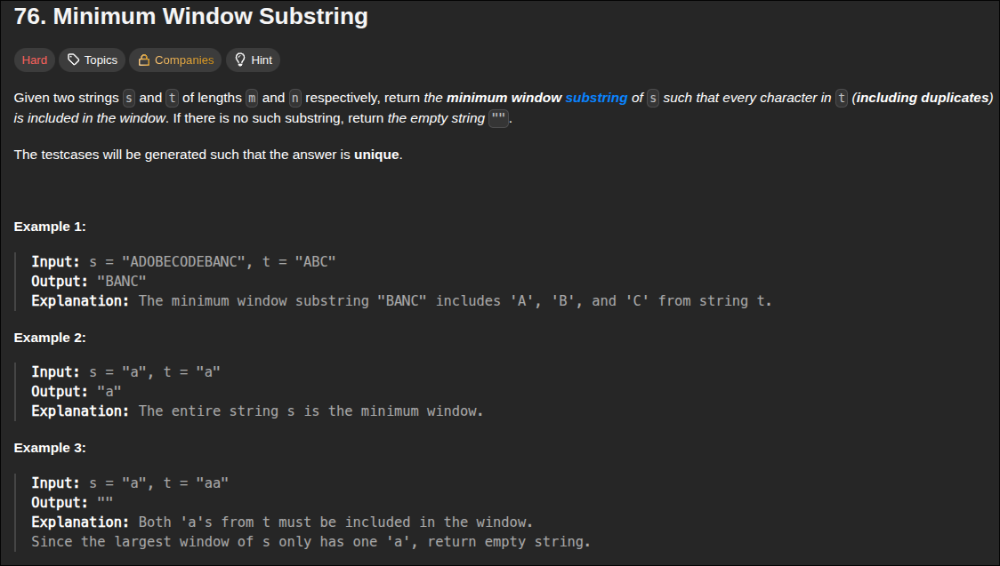
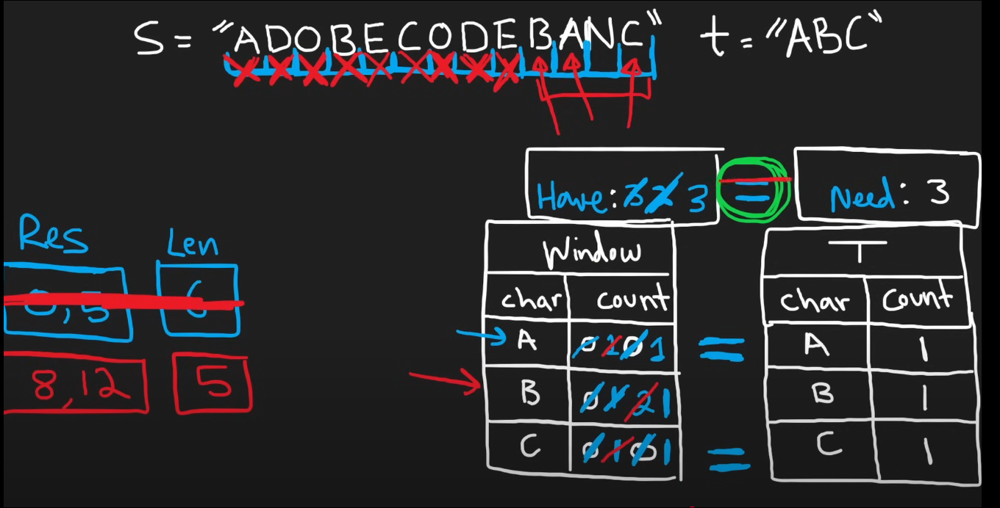
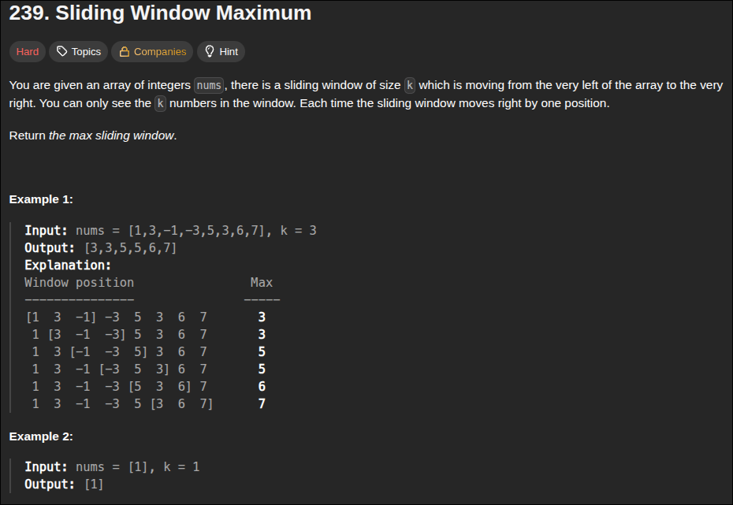
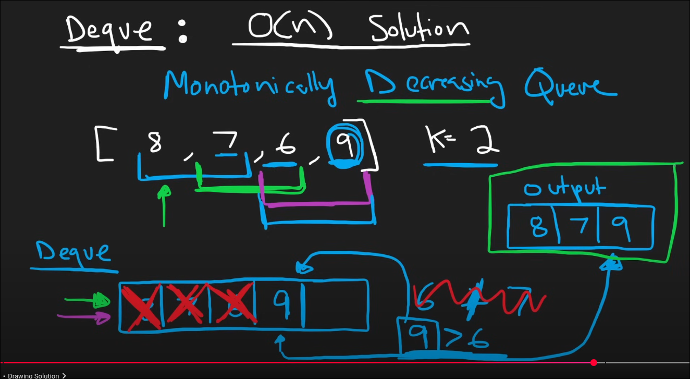

### 1. Best Time to Buy / Sell Stock


<br>
- initialize a ***left and right pointer*** for `buy and sell` day respectively


```python
class Solution:
    def maxProfit(self, prices: List[int]) -> int:
        l, r = 0, 1
        max_profit = 0
        while r < len(prices):
            if prices[l] < prices[r]:
                profit = prices[r] - prices[l]
                max_profit = max(max_profit, profit)
            else:
                l=r
            r+=1
        return max_profit
```

TLDR :

> - 2 pointer L,R for buy and sell respectively
> - L should be less than R to book profits
> - measure max profit as R-L else make L=R and do R+=1 every iteration

---

### 2. Longest Substring Without Repeating Characters


- use ***sliding window + 2 pointer approach + hashset***
- l, r in same place then move r and keep adding r to hashset if not there, if there then remove l and do l++
- find all substrings like this with res = max(res, r-l+1)

```python
class Solution:
    def lengthOfLongestSubstring(self, s: str) -> int:
        charset = set()
        l = 0
        res = 0
        for r in range(len(s)):
            while s[r] in charset:
                charset.remove(s[l])
                l+=1
            charset.add(s[r])
            res = max(res, r-l+1)
        return res
```

TLDR:

> - 2 pointers L = 0 and R from 0 to end
> - add unseen s[R] to hashset and if seen, then remove s[L] and do L++
> - keep res = max(res, R-L+1) and return it 

---

### 3. Longest Repeating Character Replacement


<br>
- 1 main condition :
> `window_length - max_freq <= k` --> then valid window_size (so maximize this)



```python
class Solution:
    def characterReplacement(self, s: str, k: int) -> int:
        count_hashmap = {}
        res = 0
        l = 0
        for r in range(len(s)):
            count_hashmap[s[r]] = 1 + count_hashmap.get(s[r], 0) # keeping count of letters
            if (r-l+1) - max(count_hashmap.values()) > k:
                count_hashmap[s[l]] -= 1
                l+=1
            res = max(res, r-l+1)
        return res
```

---

### 4. Permutation In String


<br>



- below is the array implementation [OPTIMIZED]
```python
class Solution:
    def checkInclusion(self, s1: str, s2: str) -> bool:
        if len(s1) > len(s2):
            return False
        s1_count, s2_count = [0]*26 , [0]*26
        
        for i in range(len(s1)):
            s1_count[ord(s1[i]) - ord('a')]+=1
            s2_count[ord(s2[i]) - ord('a')]+=1 # window length as much as s1

        matches = 0
        for i in range(26):
            matches += (1 if s1_count[i] == s2_count[i] else 0)

        l = 0
        for r in range(len(s1), len(s2)):
            if matches == 26:
                return True

            index = ord(s2[r]) - ord('a') # right side addition
            s2_count[index]+=1
            if s1_count[index] == s2_count[index]:
                matches+=1
            elif s2_count[index]-1 == s1_count[index]:
                matches-=1

            index = ord(s2[l]) - ord('a')  # left side deletion
            s2_count[index]-=1
            if s2_count[index] == s1_count[index]:
                matches+=1
            elif s2_count[index]+1 == s1_count[index]:
                matches-=1
            l+=1
        
        return matches == 26
```

- hashmap implementation
```python
class Solution:
    def checkInclusion(self, s1: str, s2: str) -> bool:
        if len(s1) > len(s2):
            return False
        
        s1_count = Counter(s1)
        window_count = Counter(s2[:len(s1)]) # 1st window till s1 length

        if s1_count == window_count:
            return True
        
        for r in range(len(s1), len(s2)):
            start_char = s2[r-len(s1)]
            end_char = s2[r]

            window_count[end_char]+=1
            window_count[start_char]-=1

            if window_count[start_char] == 0:
                del window_count[start_char]
            
            if window_count == s1_count:
                return True
        
        return False
```

TLDR:

> - Use Counter to track character frequencies of s1 and the current window in s2.  
> - Slide the window one char at a time: add incoming char, remove outgoing char.  
> - Check if window Counter equals s1 Counter.  
> - Time: O(n * 26) worst case, practically near O(n)  
> - Space: O(1) — only lowercase letters tracked

---

### 5. Minimum Window Substring


<br>



```python
from collections import Counter
class Solution:
    def minWindow(self, s: str, t: str) -> str:
        if t == "":
            return ""
        
        T = Counter(t)
        window = {}
        have, need = 0, len(T)
        res, resLen = [-1,-1] , float('inf')
        l = 0
        for r in range(len(s)):
            c = s[r]
            window[c] = 1 + window.get(c,0)
            if c in T and window[c] == T[c]:
                have+=1
            while have == need:
                # update our result
                if (r-l+1) < resLen:
                    res = [l,r]
                    resLen = r-l+1
                
                # popping from left of window
                window[s[l]]-=1
                if s[l] in T and window[s[l]] < T[s[l]]:
                    have-=1
                l+=1
        i,j = res
        return s[i:j+1] if resLen != float('inf') else ""
```

---

### 6.  Sliding Window Maximum 


<br>


```python
class Solution:
    def maxSlidingWindow(self, nums: List[int], k: int) -> List[int]:
        output = []
        l=r=0
        q = collections.deque()

        while r < len(nums):
            # pop small values from q 
            while q and nums[q[-1]] < nums[r]:
                q.pop()
            q.append(r)

            if l > q[0]:
                q.popleft()
            
            if r+1 >= k:
                output.append(nums[q[0]])
                l+=1
            r+=1
```

---
