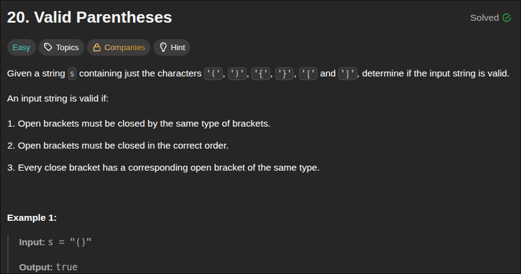
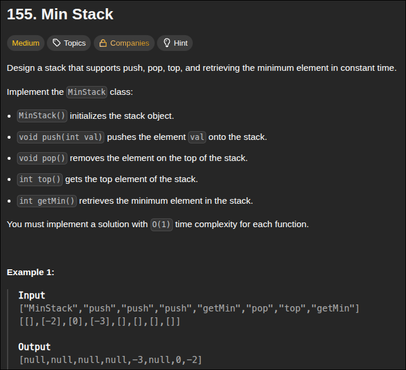
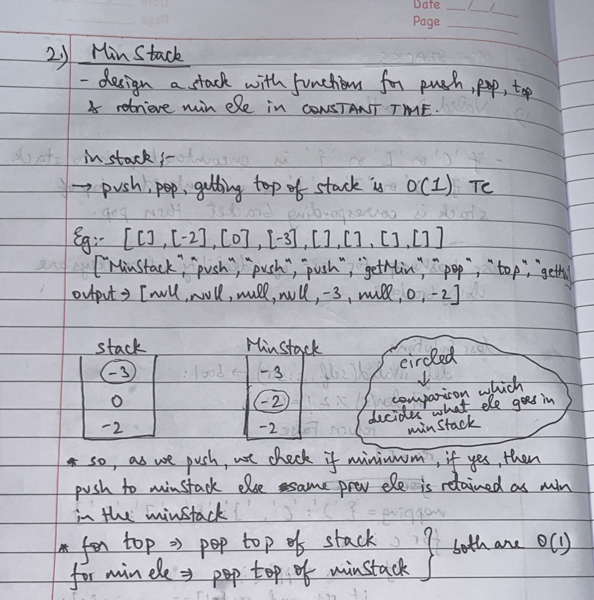
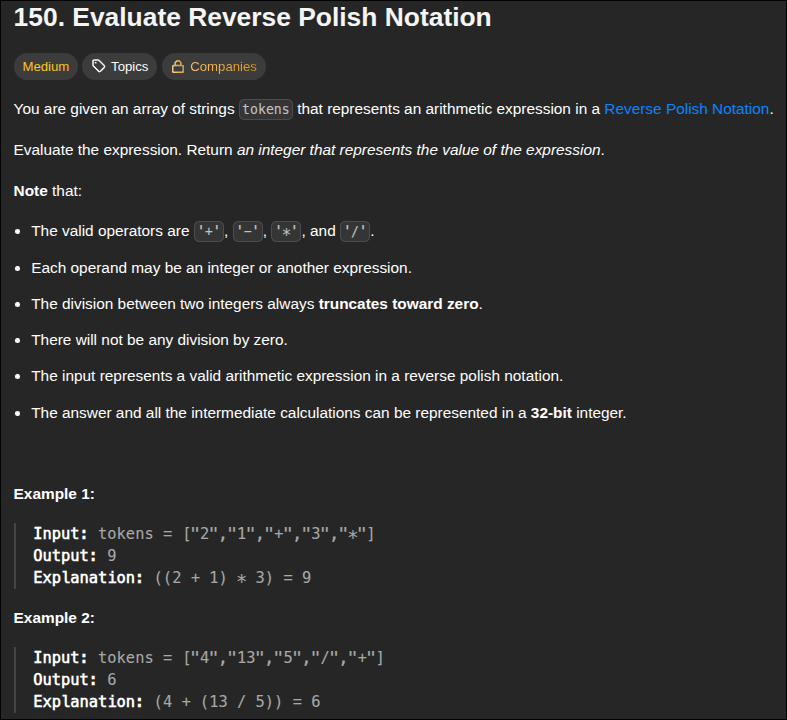

### 1. Valid Parentheses


<br>
- use a hashmap with `closing parentheses` as key and `opening parentheses` as value, check if in hashmap then pop else dont
```python
class Solution:
    def isValid(self, s: str) -> bool:
        if len(s) % 2 !=0:
            return False
        res=[]

        mapping = {')':'(', '}':'{', ']':'['}
        for c in s:
            if c in mapping:
                if res and res[-1] == mapping[c]:
                    res.pop()
                else:
                    return False
            else:
                res.append(c)
        return True if not res else False

```

---

### 2. Min Stack


<br>
- writing functions for all these operations


```python 
class MinStack:

    def __init__(self):
        self.stack = []
        self.minStack = []

    def push(self, val: int) -> None:
        self.stack.append(val)
        val = min(val, self.minStack[-1] if self.minStack else val)
        self.minStack.append(val)

    def pop(self) -> None:
        self.stack.pop()
        self.minStack.pop()

    def top(self) -> int:
        return self.stack[-1]

    def getMin(self) -> int:
        return self.minStack[-1]
```

---

### 3. Evaluate Reverse Polish Notation


<br>
- no need for 2 stacks for operands and operators each like in **theory of computation**, calm down ***dont overthink like an idiot***, keep it simple and ez
```python
class Solution:
    def evalRPN(self, tokens: List[str]) -> int:
        stack = []
        for c in tokens:
            if c == '+':
                stack.append(stack.pop() + stack.pop())
            elif c == '-':
                a, b = stack.pop(), stack.pop()
                stack.append(b-a) # i - (i+1) typeshi
            elif c == '*':
                stack.append(stack.pop() * stack.pop())
            elif c == '/':
                a, b = stack.pop(), stack.pop()
                stack.append(int(b/a)) # it'll round toward 0 
            else: # otherise it's a number (RPN no edge cases) 
                stack.append(int(c))
        return stack[0]
```