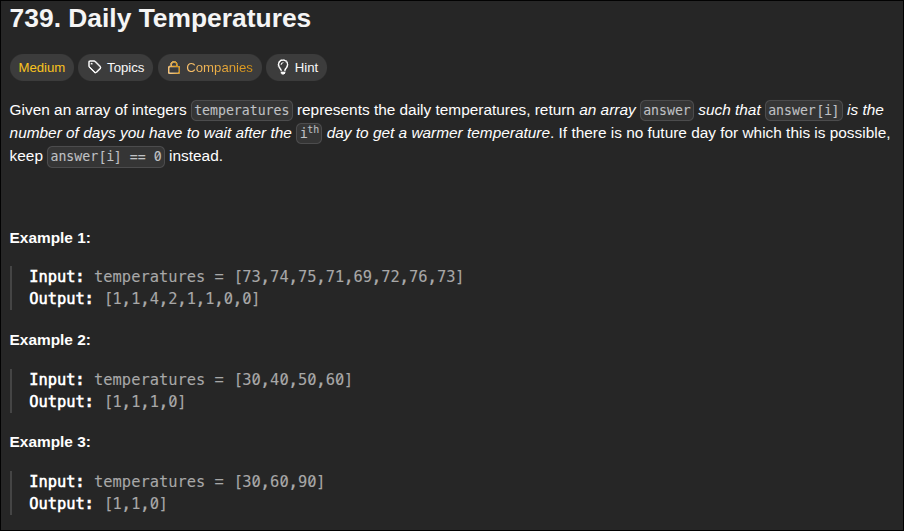
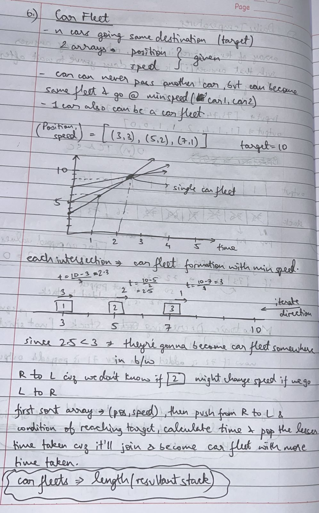

### 1. Valid Parentheses


<br>
- use a hashmap with `closing parentheses` as key and `opening parentheses` as value, check if in hashmap then pop else dont
```python
class Solution:
    def isValid(self, s: str) -> bool:
        if len(s) % 2 !=0:
            return False
        res=[]

        mapping = {')':'(', '}':'{', ']':'['}
        for c in s:
            if c in mapping:
                if res and res[-1] == mapping[c]:
                    res.pop()
                else:
                    return False
            else:
                res.append(c)
        return True if not res else False

```

---

### 2. Min Stack


<br>
- writing functions for all these operations


```python 
class MinStack:

    def __init__(self):
        self.stack = []
        self.minStack = []

    def push(self, val: int) -> None:
        self.stack.append(val)
        val = min(val, self.minStack[-1] if self.minStack else val)
        self.minStack.append(val)

    def pop(self) -> None:
        self.stack.pop()
        self.minStack.pop()

    def top(self) -> int:
        return self.stack[-1]

    def getMin(self) -> int:
        return self.minStack[-1]
```

---

### 3. Evaluate Reverse Polish Notation


<br>
- no need for 2 stacks for operands and operators each like in **theory of computation**, calm down ***dont overthink like an idiot***, keep it simple and ez
```python
class Solution:
    def evalRPN(self, tokens: List[str]) -> int:
        stack = []
        for c in tokens:
            if c == '+':
                stack.append(stack.pop() + stack.pop())
            elif c == '-':
                a, b = stack.pop(), stack.pop()
                stack.append(b-a) # i - (i+1) typeshi
            elif c == '*':
                stack.append(stack.pop() * stack.pop())
            elif c == '/':
                a, b = stack.pop(), stack.pop()
                stack.append(int(b/a)) # it'll round toward 0 
            else: # otherise it's a number (RPN no edge cases) 
                stack.append(int(c))
        return stack[0]
```

---

### 4. Generate Parentheses


- backtracking solution with `recursive approach` using stack


```python
class Solution:
    def generateParenthesis(self, n: int) -> List[str]:
        # add open parentheses only if open < n
        # add closed parentheses only if close < open
        # stop the flow only when open == close == n

        stack = []
        res = []

        def backtrack(openN, closedN):
            if openN == closedN == n:
                res.append("".join(stack))
                return 
            
            if openN < n:
                stack.append("(")
                backtrack(openN + 1, closedN)
                stack.pop()
            
            if closedN < openN:
                stack.append(")")
                backtrack(openN,closedN+1)
                stack.pop()
        backtrack(0,0)
        return res
```

---

### 5. Daily Temperatures 



- enumerate both temperature,index in temperatures and while next ***t is > top of stack t***, keep popping
- ***MONOTONOUS DECREASING STACK***


```python
class Solution:
    def dailyTemperatures(self, temperatures: List[int]) -> List[int]:
        res = [0] * len(temperatures)
        stack = []

        for i,t in enumerate(temperatures):
            while stack and t > stack[-1][0]:
                stackT, stackInd = stack.pop()
                res[stackInd] = i - stackInd
            stack.append([t,i])
        return res
```

---
### 6. Car Fleet


- zip the (pos,speed) into pair
- iterate in the ***sorted pair but reverse*** so as to `avoid redundancy` while calculating catch-ups
- append the time taken and check if new car takes lesser/equal time than old car --> if yes then pop()


```python
class Solution:
    def carFleet(self, target: int, position: List[int], speed: List[int]) -> int:
        pair = [[p,s] for p,s in zip(position,speed)]
        stack = []  
        for p,s in sorted(pair)[::-1]: # Reverse Sorted Order
            stack.append((target - p)/s)
            if len(stack)>=2 and stack[-1] <= stack[-2]:
                stack.pop()
        return len(stack)
```

---
### 7. Largest Rectangle in Histogram 


```python
class Solution:
    def largestRectangleArea(self, heights: List[int]) -> int:
        maxArea = 0
        stack = [] # pair: [index,height]
        for i,h in enumerate(heights):
            start = i
            while stack and stack[-1][1] > h: # not in increasing order so pop
                index, height = stack.pop()
                maxArea = max(maxArea, height * (i-index))
                start = index
            stack.append((start,h))
        
        for i,h in stack: # leftover unpopped elements
            maxArea = max(maxArea, h * (len(heights)-i))
        return maxArea
                 
```

- next is the other approach using ***next smallest element(NSE)*** and ***previous smallest element (PSE)*** concepts
- below is just the concept implementation (`circular variation`)
```python
class Solution:
    def nextGreaterElements(self, nums: List[int]) -> List[int]:
        n = len(nums)
        nge = [-1] * n
        st = []


        for i in range(2 * n - 1, -1, -1):
            while st and st[-1] <= nums[i % n]:
                st.pop()


            if i < n:
                if st:
                    nge[i] = st[-1]
            st.append(nums[i % n])
        return nge

```

for NSE PSE:
```python
class Solution:
    def nextSmallestElements(self, nums: List[int]) -> List[int]:
        n = len(nums)
        nse = [-1] * n
        st = []


        for i in range(n):
            while st and st[-1] >= nums[i]:
                st.pop()
            if st:
                nse[i] = st[-1]
        st.append(nums[i])
        return nse
```


final code other approach
```python
class Solution:
    def largestRectangleArea(self, heights: List[int]) -> int:
        stack = []
        maxArea = 0
        n = len(heights)

        for i in range(n):
            # Maintain increasing stack
            while stack and heights[stack[-1]] > heights[i]:
                top = stack.pop()
                height = heights[top]
                # Width is i - stack[-1] - 1 if stack still has elements
                width = i if not stack else i - stack[-1] - 1
                maxArea = max(maxArea, height * width)
            stack.append(i)

        # Process any remaining elements
        while stack:
            top = stack.pop()
            height = heights[top]
            width = n if not stack else n - stack[-1] - 1
            maxArea = max(maxArea, height * width)

        return maxArea
```