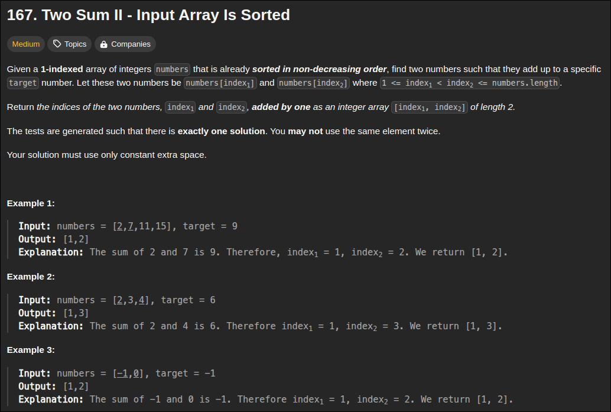
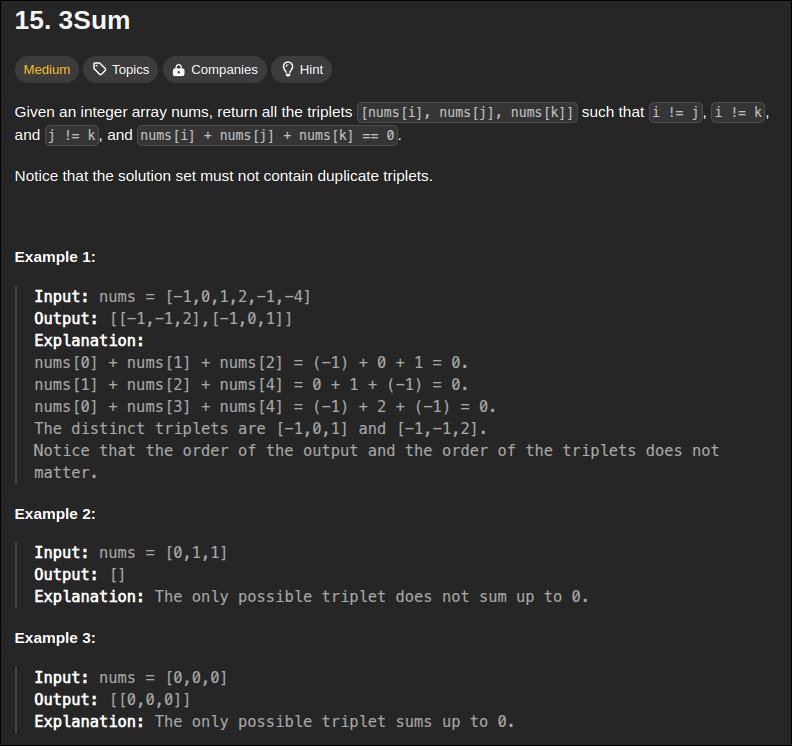
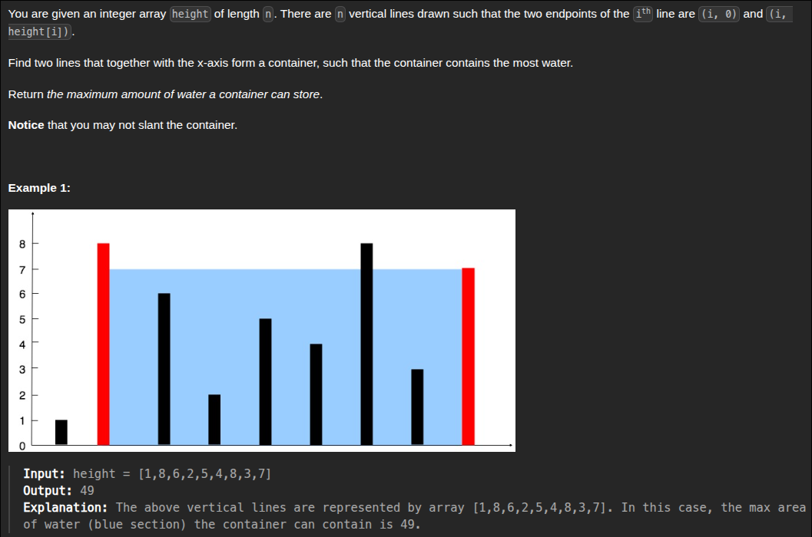
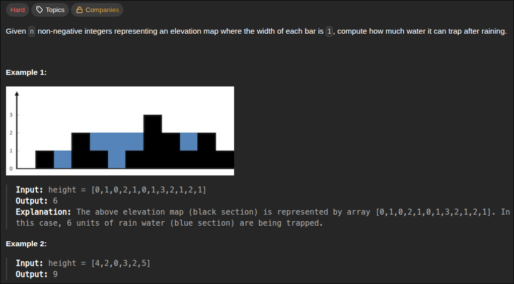
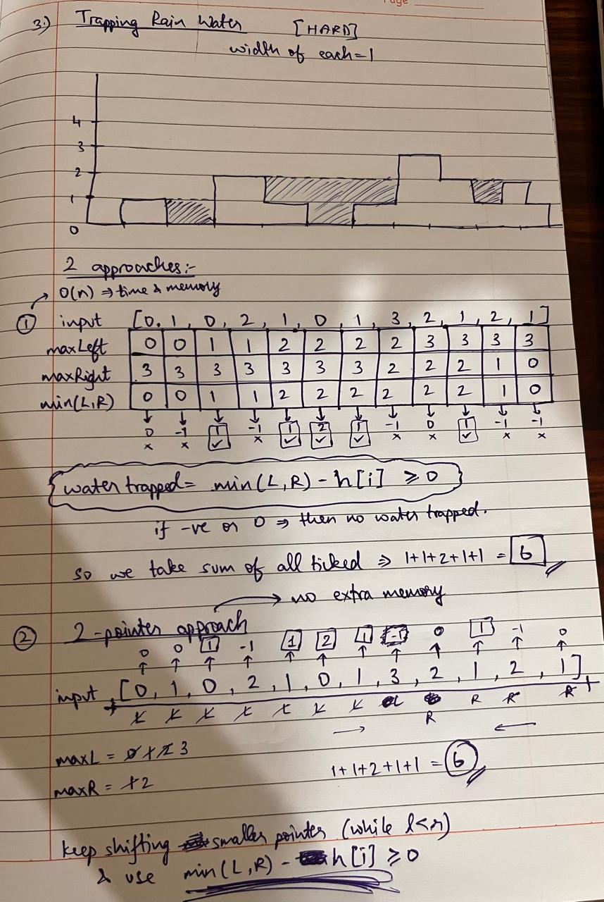

### 1. Valid Palindrome 

- there's not much to say except only consider alphanumeric and no spaces, commas, colons and stuff
  
```python 
class Solution:
    def isPalindrome(self, s: str) -> bool:
        s = ''.join(c.lower() for c in s if c.isalnum())
        l = 0
        r = len(s)-1
        while l <= r:
            if s[l] != s[r]:
                return False
            l+=1
            r-=1
        return True
```

TLDR : 
> - Convert the string to lowercase and remove non-alphanumeric characters.
> - Use two pointers (`l` and `r`) starting from both ends of the string.
> - If the entire loop finishes without a mismatch, return True.
> - Time Complexity: O(n), where n is the length of the string.
> - Space Complexity: O(n), due to the cleaned version of the string.

---

### 2. Two Sum (part 2)


<br>
- Main thing is that here array/list is in `non-decreasing` order so that gives us instant `2-pointer idea` (***SAME LIKE BINARY SEARCH***)
- *same l,r method but if total < target then l++ else r--*
- 1-based index is asked 
<br>

```python

class Solution:
    def twoSum(self, numbers: List[int], target: int) -> List[int]:
        l, r = 0, len(numbers)-1

        while l < r:
            total = numbers[l] + numbers[r]
            if total == target:
                return [l+1, r+1]
            if total < target:
                l+=1
            else:
                r-=1
```

TLDR:

> - Since the array is sorted (`ASCENDING`) , use two pointers from both ends.
> - Move inward: if the sum is too small, shift left pointer; if too big, shift right.
> - This avoids brute-force and gives O(n) time.

---

### 3. 3 Sum 


<br>
- first sort the array - `O(nlogn)` , then 2 for loops will be there, 1 for selecting first element and another for solving 2Sum using 1st element as target
> So overall Time Complexity = O(n^2)

- But if in the leftover array, the element is same as the 1st ele (being used as target), then duplicates will occur so we filter out those

```python
class Solution:
    def threeSum(self, nums: List[int]) -> List[List[int]]:
	    res = []
	    nums.sort()

		for i, a in enumerate(nums):
			if i > 0 and a == nums[i-1]:
				continue

			left, right = i+1 , len(nums)-1
			while left < right:
				threeSum = a + nums[left] + nums[right]
				if threeSum > 0:
					right-=1
				elif threeSum < 0:
					left+=1
				else:
					res.append([a, nums[left], nums[right]])
					while left < right and nums[left] == nums[left-1]
						left+=1
		return res
```

TLDR:
> - sort array
> - dont consider duplicates, skip that iteration
> - lock onto 1st value as target, then rest of array do 2Sum II 
> - if target < 0 --> l++ 
> - if target > 0 --> r--
> - if target = 0 --> add the triplet to result

---

### 4. Container With Most Water


<br>
- basically right and left pointer and max area, first we can do a bruteforce approach with `O(n^2)` but we get `TLE`

```python
class Solution:
    def maxArea(self, height: List[int]) -> int:
	    res = 0
	    for l in range(len(height)):
		    for r in range(l+1 , len(height)):
			    area = (r-l) * min(height[r], height[l])  # height bottleneck 
			    res = max(res, area)
		return res
```

- so next we optimize the approach and try with O(n)

```python
class Solution:
    def maxArea(self, height: List[int]) -> int:
        res = 0
        l, r = 0, len(height)-1
        while l < r:
            area = (r-l) * min(height[l], height[r])
            res = max(res, area)
            if height[l] < height[r]:
                l+=1
            elif height[l] > height[r]:
                r-=1
            else: #equality condition but can be merged with previous condition
                r-=1
        return res
```
<br>
TLDR:

> - take left and right pointers as 0 and len-1
> - while l < r --> calc area with height bottleneck
> - compare with res to get max area 
> - if left height < right height --> l++ else r--
> - return res

---

### 5. Trapping Rainwater 


<br>
- there's 2 approaches using `maxLeft` & `maxRight` and the formula :

> ***water trapped = min(L, R) - h[i] >= 0***

- 1st approach has *extra memory of O(n)* and 2nd approach is ***2-pointer approach*** wit O(1) memory, both have same ***O(n) time complexity***



```python
class Solution:
    def trap(self, height: List[int]) -> int:
		res = 0 # trapped water square units
		if not height:
		    return 0 # if input is empty
		l, r = 0, len(height)-1
		leftMax, rightMax = height[l], height[r]
		while l < r:
			if leftMax < rightMax:
				l+=1
				leftMax = max(leftMax, height[l])
				res += leftMax - height[l]
			else:
				r-=1
				rightMax = max(rightMax, height[r])
				res += rightMax - height[r]
		return res
```

TLDR:

> - take 2 pointers l, r = 0, len-1
> - edge case if no input should be taken care
> - take leftMax and rightMax as initial height[l] and height[r]
> - if leftMax < rightMax --> l++ and then take max of new height[l] and leftMax and add res with leftMax - height[l]
> - same for right in else condition
> - return res

---
